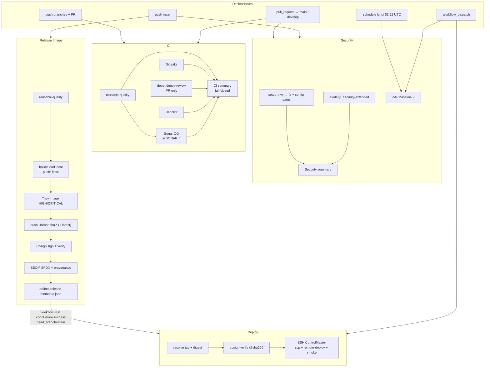
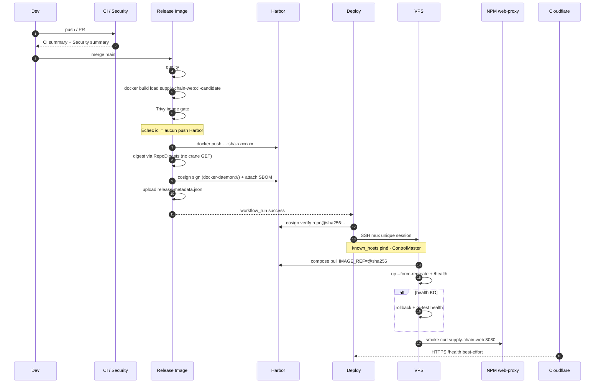
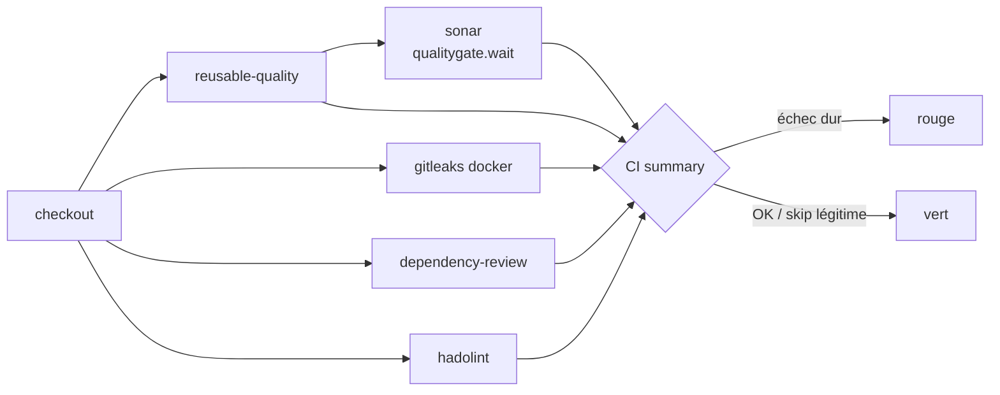

# Supply Chain Demo — DevSecOps kit

Chaîne CI/CD **prête à brancher** : qualité → sécurité → image scannée & signée → deploy par digest.

Elle a d’abord servi [zenora360.com](https://zenora360.com) (Vite/React → Harbor → Compose → Nginx Proxy Manager → Cloudflare, VPS OVH).  
Ce n’est **pas** un bricolage mono-vitrine : c’est une **colonne vertébrale** réutilisable. Tu copies `.github/` + `deploy/`, tu renommes `IMAGE_NAME`, tu branches tes secrets, tu livres.

Fail-closed là où ça compte : rien dans Harbor sans Trivy image OK, pas de SSH sans Cosign verify, pas de prod sur `latest`.

**Signal UI :** badges CI / Security / Release sur le README du site.  
**Slack :** échecs Release + tous les Deploy (succès ou échec) — pas de spam sur un Release vert.  
**paths-ignore :** `*.md` / LICENSE ne déclenchent pas CI, Security ni Release (schedule ZAP et `workflow_dispatch` restent).

---

## Ce que tu récupères

```text
.github/
├── README.md                 ← tu es ici
├── dependabot.yml
├── zap-rules.tsv
├── scripts/
│   ├── normalize-harbor.sh   # registry/project clean (pas de https://, lowercase…)
│   └── ssh-with-secrets.sh   # clé privée + known_hosts pinés
└── workflows/
    ├── reusable-quality.yml  # Hadolint · asset checks · image build · /health
    ├── reusable-notify.yml   # Slack optionnel
    ├── ci.yml
    ├── security.yml
    ├── release.yml
    └── deploy.yml

# à greffer / adapter dans le repo app
deploy/
├── remote-deploy.sh          # pull @digest · up · health · rollback · logout
└── smoke-test.sh             # conteneur + réseau proxy + digest
docker-compose.yml            # prod : réseau proxy external, pas de bind :80
docker-compose.local.yml      # local : port publié
```

---

## Carte des workflows (ce qui part vraiment)

Chaque flèche = un déclencheur GitHub réel, pas un schéma marketing.



| Workflow | Déclencheur | Sortie utile |
| -------- | ----------- | ------------ |
| **CI** | PR + push | gates merge ; check GitHub `CI summary` |
| **Security** | PR / main + cron | gates ; check `Security summary` ; ZAP artefact |
| **Release** | `main` (+ `v*`) | image Harbor + signatures + `release-metadata` |
| **Deploy** | Release OK sur `main`, ou manuel (`sha-*` + digest) | conteneur prod healthy |

---

## Release → prod (séquence réelle)

Exactement l’ordre des jobs / steps sur un push `main` réussi.



---

## Runtime serveur (modèle cible)

Valable pour zenora360 et pour tout projet derrière un reverse proxy Docker.

```mermaid
flowchart LR
  subgraph internet["Internet"]
    U[Clients]
  end

  subgraph edge["Edge optionnel"]
    CF[Cloudflare]
  end

  subgraph vps["VPS"]
    NPM["Nginx Proxy Manager<br/>:80 / :443"]
    WEB["app container<br/>ex. supply-chain-web:8080"]
    NET[["docker network<br/>PROXY_NETWORK<br/>ex. web-proxy"]]
    NPM --- NET
    WEB --- NET
  end

  subgraph registry["Registry"]
    HAR[(Harbor<br/>image@sha256)]
  end

  U --> CF --> NPM
  NPM -->|"Host: container name<br/>Port: 8080"| WEB
  HAR -.->|"deploy: pull digest"| WEB
```

Règles apprises en prod :

- **Pas de bind hôte `:80`** si NPM/Traefik tient déjà 80/443.
- Upstream = **nom DNS Docker** du conteneur + port interne.
- Deploy GitHub = **une** session SSH (`ControlMaster`). UFW `limit` + scp/ssh en rafale = `i/o timeout`.
- Smoke qui compte = conteneur + réseau proxy. HTTPS public peut 403 (Bot Fight) → exception `/health` recommandée.
- Harbor : artefacts ~850 Ko tagués `sha256-…` “unsigned” = **signatures Cosign**, pas des images foireuses.

---

## CI — zoom jobs



- Sonar **Community** : ne pas passer `sonar.branch.name` / `pullrequest.*` (édition Developer).
- Secrets Sonar absents → skip explicite. Présents → gate **bloquante**.

---

## Principes (non négociables)

1. Même discipline partout (qualité → scan image → sign → digest deploy).
2. Aucune image registry tant que Trivy image HIGH/CRITICAL n’est pas vert.
3. Prod = **digest** ; `sha-*` = alias ; `latest` refusé au deploy.
4. Cosign verify **avant** SSH.
5. Rollback avec preuve (`rollback healthy` / `rollback failed`).
6. Actions critiques pinées **SHA**.
7. Harbor Cosign policy : digest résolu en local + `cosign sign docker-daemon://…` (pas de GET manifesto non signé).

---

## Reproduire sur un autre projet

1. Copier `.github/` + `deploy/` (+ compose si le modèle proxy te va).
2. Adapter : `IMAGE_NAME`, `sonar.projectKey`, titres Slack, nom d’environment.
3. Créer les secrets ci-dessous.
4. Brancher le proxy : `PROXY_NETWORK` + upstream `container:port`.
5. Branch protection : checks **`CI summary`** + **`Security summary`** ; env deploy = `main` only.
6. Premier Release sur `main` → Deploy auto.

Tu ne réécris pas la chaîne. Tu **personnalises** la colonne vertébrale.

### Check-list premier run

- [ ] Secrets Harbor + SSH + `DEPLOY_SSH_KNOWN_HOSTS`
- [ ] `SONAR_HOST_URL` + `SONAR_TOKEN` + projet Sonar `supply-chain-demo`
- [ ] `PROXY_NETWORK` = réseau du reverse proxy
- [ ] Proxy → `container:port` (ex. `supply-chain-web:8080`)
- [ ] Branch protection + env `production` (main only)
- [ ] Slack si besoin
- [ ] Exception edge sur `/health` si smoke public souhaité

---

## Secrets & variables

### Registry
`HARBOR_REGISTRY` · `HARBOR_PROJECT` · `HARBOR_USERNAME` · `HARBOR_PASSWORD`  
(host only, lowercase, **pas** de `https://`)

### CI — SonarQube (repo secrets)
`SONAR_HOST_URL` · `SONAR_TOKEN`  
Projet Sonar : clé `supply-chain-demo` (voir `sonar-project.properties`).  
Absents → job skip explicite. Présents → `qualitygate.wait` **bloquant** sur `main` / `develop` / PR vers ces branches.  
Community Build : pas de `sonar.branch.name` / `pullrequest.*`.

### Deploy — environment `production`
`DEPLOY_SSH_HOST` · `DEPLOY_SSH_USER` · `DEPLOY_SSH_KEY` · `DEPLOY_SSH_PORT` · `DEPLOY_APP_DIR` · **`DEPLOY_SSH_KNOWN_HOSTS`**

```bash
ssh-keyscan -p "$PORT" "$HOST"
# coller les lignes [ip]:port ssh-ed25519|ecdsa|rsa … dans le secret
```

### Optionnel
`SLACK_WEBHOOK_URL` (**secret repo**, pas seulement l’env)

### Vars environment
`PROXY_NETWORK` (défaut `web-proxy`) · `PUBLIC_BASE_HOST`

---

## Stack cible typique

| Brique | Rôle |
| ------ | ---- |
| GitHub Actions | orchestration |
| Harbor (OCI) | images + signatures |
| Cosign keyless | signature OIDC GitHub |
| Docker Compose | runtime |
| NPM / Caddy / Traefik | TLS + routage |
| Cloudflare | edge (optionnel) |

---

## Licence / usage interne

Conçu pour les livraisons ZENORA. Réutilisable en interne : même discipline supply chain, autres noms, autres secrets.
