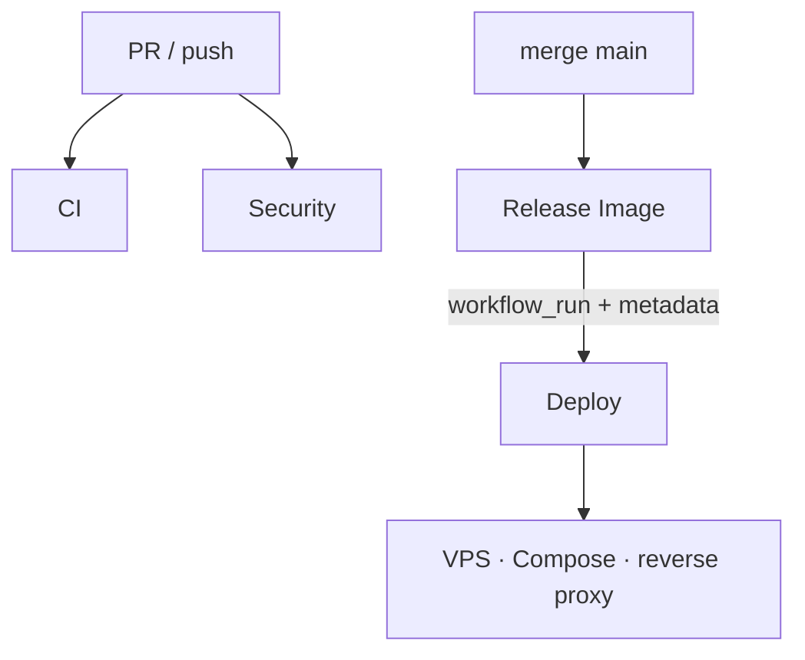

# Supply Chain Demo

[](https://github.com/barthez-kenwou/supply-chain-demo/actions/workflows/ci.yml)
[](https://github.com/barthez-kenwou/supply-chain-demo/actions/workflows/security.yml)
[](https://github.com/barthez-kenwou/supply-chain-demo/actions/workflows/release.yml)

**OCI supply-chain pipeline** — reusable DevSecOps backbone for shipping a container to production without “push and pray”.

This repo is a **portfolio / template** project: a tiny static site on nginx, plus the full delivery chain I designed and ran in production on [zenora360.com](https://zenora360.com).

> Quality → Security → build → Trivy gate → Harbor → Cosign + SBOM + provenance → digest deploy over SSH → smoke on a reverse-proxy Docker network.

---

## Why this exists

Most “CI demos” stop at `npm test`. Here the point is the **path to prod**:

- nothing lands in the registry before an image scan gate
- deploy never uses `latest`
- Cosign verify happens **before** SSH
- the host pulls `@sha256:…`, not a retaggable tag alone
- runtime sits behind Nginx Proxy Manager (or any proxy) on a shared Docker network — no hijacking host `:80`

The `app/` folder is intentionally minimal (Option B: static HTML). Swap it for your real service; keep `.github/` + `deploy/`.

---

## Pipeline map



| Workflow | Role |
| -------- | ---- |
| `ci.yml` | Hadolint, gitleaks, build + `/health`, SonarQube QG (si `SONAR_*`) |
| `security.yml` | Trivy fs/config, CodeQL, ZAP (weekly / manual) |
| `release.yml` | build → Trivy image → push → Cosign → SBOM → provenance |
| `deploy.yml` | verify digest → SSH mux → pull → health / rollback → smoke |

Technical deep-dive: [`.github/README.md`](.github/README.md).

---

## Quick local run

```bash
make compose-up
curl -fsS http://127.0.0.1:8080/health   # OK
# open http://127.0.0.1:8080/
```

---

## Reuse on another product

1. Copy `.github/` + `deploy/` (+ compose if the proxy model fits).
2. Change `IMAGE_NAME` (`supply-chain-web` → yours).
3. Wire Harbor + SSH secrets (see `.github/README.md`).
4. Point your reverse proxy at `container:8080` on `PROXY_NETWORK`.

---

## Production proof

The same discipline powers **ZENORA Web** ([zenora360.com](https://zenora360.com)): Harbor, Cosign keyless, digest deploy, Nginx Proxy Manager, Cloudflare edge.

---

## Author

[Barthez Kenwou](https://barthez-kenwou.dev/) — DevSecOps / platform-minded delivery.
